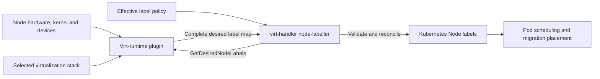
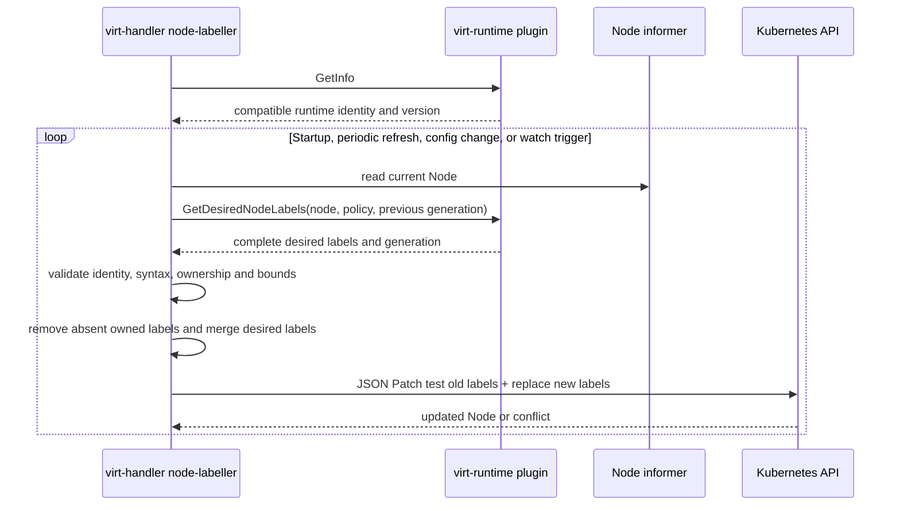

# Virtualization-Stack Capability Discovery and Node Labeling

## Status

Design proposal.

## Summary

KubeVirt currently discovers node virtualization capabilities by running `node-labeller.sh` from the selected `virt-launcher` image as a privileged init container of the `virt-handler` DaemonSet. The script starts `virtqemud`, queries libvirt with `virsh`, and writes several XML files to a host-mounted directory. At startup, `virt-handler` and its node-labeller parse those libvirt-specific files, derive KubeVirt capability labels, and patch the Kubernetes Node.

This proposal moves capability interpretation and label generation behind the node-local **virt-runtime plugin** introduced for virtualization-stack-specific `virt-handler` operations. The selected plugin runs as a DaemonSet pod on each node and returns the **complete desired set of Node labels** for its virtualization stack. `virt-handler` does not consume libvirt XML or any other stack capability format. It validates the returned map as an opaque, authoritative label set and reconciles it onto the Node.

This is separate from the pluggable per-VMI `virt-launcher` described in [virt-handler virtualization-stack dependency analysis](virt-handler-virtualization-stack-analysis.md). The launcher implements the Command and Notify APIs and manages an individual VM. The node plugin discovers node-wide runtime capabilities and performs stack-specific node operations. It never patches the Node directly.

## Goals

- Remove the requirement that `virt-handler` parse libvirt capability XML.
- Allow libvirt/QEMU, Cloud Hypervisor, or another homogeneous virtualization stack to discover capabilities in its native way.
- Make the selected node plugin responsible for producing the exact KubeVirt labels consumed by scheduling and migration.
- Keep Node reads, validation, conflict handling, retries, and patches in `virt-handler`.
- Preserve the current capability-label keys and scheduling behavior for the libvirt/QEMU implementation.
- Give label removal explicit desired-state semantics so stale labels do not survive a capability change.
- Support plugin and `virt-handler` restart, rolling upgrades, and transient failures without partial label updates.

## Non-goals

- Supporting a migration between different virtualization stacks.
- Defining a common CPU, machine, confidential-computing, or VMM capability schema.
- Requiring plugins to return libvirt XML or another common intermediate capability document.
- Giving a runtime plugin Kubernetes credentials or permission to patch Nodes.
- Moving per-VMI runtime operations from the pluggable `virt-launcher` into the node plugin.
- Redesigning the scheduler-side interpretation of existing KubeVirt capability labels in the first implementation.

## Terminology

- **Stack-specific `virt-launcher`:** the per-VMI image implementing the existing Command and Notify APIs for one virtualization stack.
- **Virt-runtime plugin:** a node-local DaemonSet pod called by `virt-handler` for stack-specific node operations, including capability-label generation.
- **Capability labels:** Node labels describing runtime-supported CPU models, CPU features, machine types, architectures, timers, confidential-computing features, and related placement constraints.
- **Owned label set:** the label key space assigned exclusively to the selected runtime plugin and reconciled by `virt-handler`.

## Current Architecture

### Capability generation

The `virt-handler` DaemonSet embeds a privileged init container named `virt-launcher`, using the configured launcher image, and invokes `node-labeller.sh` ([DaemonSet construction](../pkg/virt-operator/resource/generate/components/daemonsets.go#L135-L177)). The script:

1. Detects the host architecture and selects a libvirt machine type.
2. Makes the configured hypervisor device available.
3. Starts `virtqemud`.
4. Runs `virsh domcapabilities` and `virsh hypervisor-cpu-baseline`.
5. Runs `virsh capabilities`.
6. Optionally probes a cross-architecture emulator.
7. Writes the results under `/var/lib/kubevirt-node-labeller/`.

The implementation is in [`node-labeller.sh`](../cmd/virt-launcher/node-labeller/node-labeller.sh#L1-L78). The generated files include:

- `capabilities.xml`;
- `virsh_domcapabilities.xml`;
- `supported_features.xml` on supported architectures;
- optional cross-architecture domain-capability XML files.

The host path is mounted into `virt-handler` by the DaemonSet ([node-labeller volume](../pkg/virt-operator/resource/generate/components/daemonsets.go#L311-L339)).

### Parsing and label generation

During startup, `virt-handler` reads `capabilities.xml`, unmarshals it into `libvirtxml.Caps`, extracts the host CPU counter and machine list, and passes them to `NewNodeLabeller` ([startup wiring](../cmd/virt-handler/virt-handler.go#L345-L380)). The node-labeller then reads and parses the remaining files in [`loadAll`](../pkg/virt-handler/node-labeller/node_labeller.go#L140-L164) and [`loadDomCapabilities`](../pkg/virt-handler/node-labeller/cpu_plugin.go#L82-L137).

[`prepareLabels`](../pkg/virt-handler/node-labeller/node_labeller.go#L241-L330) translates parsed capabilities and KubeVirt configuration into labels. The current output includes:

- supported CPU models and CPU features;
- CPU models usable as migration targets;
- host CPU model, required host-model features, and CPU vendor;
- supported machine types;
- Hyper-V features;
- TSC frequency and scalability;
- real-time capability;
- SEV, SEV-ES, SEV-SNP, TDX, and IBM Secure Execution;
- native and supported emulated VM architectures;
- an obsolete-host-model marker.

Every three minutes, and when relevant KubeVirt configuration changes, the controller queues the node for reconciliation ([`NodeLabeller.Run`](../pkg/virt-handler/node-labeller/node_labeller.go#L121-L139)). It removes labels matching its known prefixes, adds the newly generated labels, and atomically patches the complete Node label map with a JSON Patch test and replace ([reconciliation and patch](../pkg/virt-handler/node-labeller/node_labeller.go#L191-L232), [owned-prefix removal](../pkg/virt-handler/node-labeller/node_labeller.go#L386-L404)).

### Consumers of the labels

These labels are an external scheduling contract, not merely diagnostic output. The pod renderer creates hard node selectors for CPU models, required CPU features, machine types, Hyper-V features, and TSC requirements in [`NodeSelectorRenderer`](../pkg/virt-controller/services/nodeselectorrenderer.go#L15-L74) and its label helpers ([label conversion](../pkg/virt-controller/services/nodeselectorrenderer.go#L159-L220)).

Live migration also derives target constraints from source-node host-model, required-feature, migration-model, and CPU-vendor labels ([migration selector construction](../pkg/virt-controller/watch/migration/migration.go#L2479-L2603)). A plugin that emits a wrong label can therefore cause a VM to be scheduled or migrated to an incompatible node.

## Problems with the Current Architecture

1. **The input contract is libvirt XML.** `virt-handler` imports libvirt XML types and understands libvirt CPU modes, model usability, feature policies, launch-security elements, machine descriptions, and TSC counters.
2. **Capability discovery is coupled to the launcher image.** A privileged init container starts `virtqemud` solely to create files for the handler's node-labeller.
3. **Interpretation is split across components.** The script chooses query arguments and produces XML, while `virt-handler` applies KubeVirt policy and decides which labels represent those results.
4. **Adding another stack requires core parsing code.** A Cloud Hypervisor implementation would otherwise need to imitate libvirt XML or add stack-specific branches to `virt-handler`.
5. **The capability files are a startup snapshot.** Refreshing labels reuses previously generated files; runtime or host changes are not rediscovered through a defined provider API.
6. **Capability XML has other current consumers.** The same startup object supplies NUMA topology to launcher options and the host CPU model to migration eligibility checks. Removing XML from node labeling must not silently remove those behaviors; they need separate stack-neutral ownership as described below.

## Proposed Architecture



The selected virt-runtime plugin discovers host and runtime capabilities using implementation-private mechanisms. A libvirt/QEMU plugin may invoke libvirt and parse its XML internally. A Cloud Hypervisor plugin may inspect the kernel, devices, Cloud Hypervisor version, CPU feature support, and its native API. Neither representation crosses the plugin boundary.

For each reconciliation, `virt-handler` sends the effective inputs that affect label policy and asks the plugin for a complete desired label map. The plugin applies stack-specific interpretation and returns the exact Kubernetes label keys and values. `virt-handler` does not derive CPU models, features, machine types, architectures, or security labels from a capability document; it only validates and applies the returned labels.

Only one virtualization stack is selected on a node in this design. Its plugin exclusively owns the registered capability-label prefixes. Homogeneous deployment remains a cluster policy, but the response carries runtime identity so configuration mistakes and rolling-upgrade mismatches can be detected.

## Plugin API

The API should use the same node-local, versioned Unix-socket transport as other `virt-handler` runtime-plugin operations. The exact protobuf package is an implementation detail; the semantic contract is:

### `GetInfo`

Returns plugin identity and API compatibility before any operational call.

```text
GetInfoResponse
  apiVersions:       repeated string
  runtimeName:       string
  runtimeVersion:    string
  pluginVersion:     string
  ownedLabelRules:   repeated LabelRule
  features:          repeated string
```

`runtimeName` must match the stack selected by KubeVirt deployment configuration. `ownedLabelRules` must match the prefixes approved for that registered plugin; the plugin cannot expand its authority dynamically.

### `GetDesiredNodeLabels`

Returns an authoritative snapshot, not a delta.

```text
GetDesiredNodeLabelsRequest
  nodeName:          string
  nativeArch:        string
  policy:
    obsoleteCPUModels:                 map[string]bool
    crossArchitectureEnabled:          bool
  previousGeneration: string

GetDesiredNodeLabelsResponse
  runtimeName:       string
  generation:        string
  observedAt:        timestamp
  labels:            map[string]string
  warnings:          repeated string
```

The request contains policy inputs because existing labels depend on KubeVirt configuration as well as physical capability. For example, obsolete CPU models are removed from supported model labels, the obsolete-host-model label is conditional, and cross-architecture labels are exposed only when that feature is enabled. Passing these inputs keeps the plugin responsible for the exact output while preserving cluster policy ownership outside the plugin.

`generation` is opaque to `virt-handler` and changes whenever the plugin's effective capability observation changes. The handler may also compute a canonical digest of the returned label map to avoid unnecessary Node patches. It must not infer capabilities from the generation value.

### Optional `WatchNodeLabels`

A streaming notification can accelerate refresh when the runtime, host, or plugin observation changes. It is only a trigger: after receiving an event, `virt-handler` calls `GetDesiredNodeLabels` again. Periodic reconciliation remains mandatory for recovery from missed events and plugin restarts.

The initial implementation can omit this method and retain the current three-minute jittered refresh loop.

## Label Contract

### Exact-output and authoritative-set semantics

The response is the complete desired set for the selected runtime at one observation generation:

- A returned key is added or updated to the returned value.
- An owned key currently on the Node but absent from the response is removed.
- Labels outside the plugin's registered ownership rules are preserved.
- An empty successful response means that no owned capability labels should remain.
- An RPC error is not an empty successful response and must never cause immediate removal.

These semantics preserve current removal behavior when a model or feature disappears while preventing the plugin from deleting labels owned by users or other KubeVirt controllers.

### Existing scheduling keys

The first libvirt/QEMU plugin must return the existing label vocabulary defined around [`CPUFeatureLabel`](../staging/src/kubevirt.io/api/core/v1/types.go#L1281-L1313) and the security/architecture labels defined nearby ([runtime capability labels](../staging/src/kubevirt.io/api/core/v1/types.go#L1341-L1363)). This avoids changes to scheduler and migration consumers.

Approved ownership should include the current node-labeller key families:

```text
cpu-feature.node.kubevirt.io/*
cpu-model.node.kubevirt.io/*
cpu-model-migration.node.kubevirt.io/*
cpu-timer.node.kubevirt.io/*
cpu-vendor.node.kubevirt.io/*
host-model-cpu.node.kubevirt.io/*
host-model-required-features.node.kubevirt.io/*
hyperv.node.kubevirt.io/*
machine-type.node.kubevirt.io/*
kubevirt.io/realtime
kubevirt.io/sev
kubevirt.io/sev-es
kubevirt.io/sev-snp
kubevirt.io/tdx
kubevirt.io/s390-pv
kubevirt.io/vm-arch-*
node-labeller.kubevirt.io/obsolete-host-model
```

The registration is authoritative, not the list returned by `GetInfo`. `virt-handler` rejects any returned key outside the configured allowlist. Two active plugins must not be registered with overlapping ownership rules.

### Opaque values, bounded authority

`virt-handler` validates only boundary properties:

- Kubernetes label-key and label-value syntax;
- key membership in the registered ownership rules;
- response runtime identity;
- maximum label count and serialized response size;
- duplicate/conflicting keys and protocol version;
- freshness and generation shape where required by the protocol.

It does not parse model names, feature names, Boolean strings, frequencies, machine types, or stack capability data. Existing control-plane consumers continue to interpret well-known KubeVirt labels as scheduling contracts.

## Reconciliation



The existing workqueue and rate-limited retry model can remain. The reconciliation algorithm is:

1. Read the Node from the local informer.
2. Respect `node-labeller.kubevirt.io/skip-node`; while present, do not call the plugin or mutate capability labels.
3. Call the selected plugin with the current effective policy.
4. Validate the complete response before modifying a Node copy.
5. Remove all currently present labels in the plugin's registered ownership set.
6. Merge all returned labels.
7. Skip the API call if the label map is unchanged.
8. Use the existing JSON Patch test-and-replace pattern so concurrent label changes produce a conflict rather than being overwritten.
9. Requeue with rate-limited backoff on conflict or plugin failure.

No partial response is applied. Validation failure rejects the entire generation and preserves the last successfully applied set.

## Readiness, Failure, and Staleness

Capability labels influence hard scheduling and migration decisions, so stale positive labels are unsafe. At the same time, removing all labels for a short plugin restart would cause unnecessary scheduling disruption.

The proposed behavior is:

1. **Before the first successful response:** do not declare runtime capability discovery ready. The node must not become eligible for new VMI scheduling through this runtime until a valid label set is applied.
2. **Transient failure after success:** retain the last applied labels, emit a warning event, and retry with backoff during a bounded grace period.
3. **Failure beyond the grace period:** fail closed for new placements. Remove the plugin-owned capability labels and mark runtime capability discovery unavailable using a handler-owned readiness condition or label integrated with VMI pod placement. Do not reuse `kubevirt.io/schedulable` without coordinating with its existing owner.
4. **Recovery:** obtain and validate a full snapshot, atomically restore the desired labels, and clear the unavailable indication.
5. **Explicit successful empty set:** remove all owned labels immediately; this is a valid capability observation, not a health failure.

The exact grace period and readiness representation require agreement with node-health and scheduling owners. They must not be encoded as plugin-provided labels because plugin health is an observation made by `virt-handler` about the plugin itself.

## Refresh Triggers

A refresh is queued on:

- node-labeller startup;
- the current three-minute jittered interval;
- a relevant KubeVirt configuration change;
- virt-runtime plugin reconnect or generation-change notification;
- node recreation or label conflict retry;
- an operator-initiated runtime plugin upgrade.

Hardware capabilities generally require a node reboot to change, but runtime upgrades and configuration changes can alter the desired labels without reboot. The API therefore must query the live plugin rather than rely exclusively on files generated by an init container.

## Separation from Other Capability Uses

Eliminating XML from label generation does not by itself eliminate every current `capabilities.xml` dependency:

- [`virtualMachineOptions`](../pkg/virt-handler/options.go#L31-L61) converts libvirt host NUMA capabilities into topology passed to the launcher.
- [`VirtualMachineController.isHostModelMigratable`](../pkg/virt-handler/vm.go#L2338-L2348) currently relies on a host CPU model string obtained from the node-labeller.

These are not reasons to expose XML through the new label API. They should be handled separately:

- The stack-specific `virt-launcher` should obtain or derive VMM configuration data that only the launcher consumes. A stack-neutral Command API extension may carry typed host topology if core orchestration genuinely needs to provide it.
- Host-model migration support should be validated by the stack-specific launcher and represented by the established scheduling labels. Shared `virt-handler` code should not recover a native CPU model by parsing plugin-generated labels.

Until those paths are refactored, the plugin-backed node-labeller can be introduced independently while the legacy capability file remains temporarily for non-label consumers. Removal of the init container and host-mounted capability directory is a later milestone, after all remaining consumers have stack-neutral owners.

## Security Model

The plugin is trusted to report virtualization capabilities, because false positive labels can schedule a VM onto incompatible hardware. The design limits the effect of that trust:

- The plugin has no Kubernetes API credentials and cannot patch Nodes.
- `virt-handler` is the only writer in this path and retains existing Node patch RBAC.
- Communication uses a node-local Unix socket in a dedicated runtime-plugin directory.
- Socket filesystem permissions and peer identity restrict callers and providers.
- Plugin registration binds one configured runtime identity to one endpoint and one non-overlapping label allowlist.
- The handler validates response size and label syntax before allocation or patching.
- Errors include plugin identity, generation, and rejected keys without logging arbitrary capability payloads or secrets.
- A plugin cannot return arbitrary `kubevirt.io/*` labels; only explicitly registered exact keys and prefixes are accepted.

Because the plugin controls scheduling facts, signing the response does not protect against a compromised plugin. Workload isolation, image provenance, least-privilege host mounts, and admission control for the plugin DaemonSet are the meaningful controls.

## Deployment and Discovery

The virt-runtime plugin is deployed as a DaemonSet with one ready instance on each eligible node. It registers or exposes a deterministic Unix socket under a directory shared only with `virt-handler`, for example:

```text
/var/run/kubevirt/virt-runtime-plugins/<runtime-name>.sock
```

KubeVirt deployment configuration selects exactly one runtime name and corresponding launcher image for a homogeneous cluster. `virt-handler` waits for that endpoint, calls `GetInfo`, verifies API compatibility and runtime identity, and then starts label reconciliation.

The plugin requires only the host devices and read-only host information needed for its discovery implementation. A libvirt implementation may need broader access while compatibility is retained; a Cloud Hypervisor implementation should not inherit those privileges automatically.

## Libvirt/QEMU Compatibility Implementation

The first plugin implementation should reproduce the current label map exactly for the same node and KubeVirt configuration.

Initially it can reuse the existing generation and parsing code internally:

1. Move or share the logic from [`node-labeller.sh`](../cmd/virt-launcher/node-labeller/node-labeller.sh), [`cpu_plugin.go`](../pkg/virt-handler/node-labeller/cpu_plugin.go), and [`prepareLabels`](../pkg/virt-handler/node-labeller/node_labeller.go#L241-L330) into the libvirt runtime plugin.
2. Keep all XML private to that plugin.
3. Pass obsolete CPU model and cross-architecture policy in the request.
4. Return the resulting complete label map.
5. Compare old and new maps in tests before allowing the plugin result to become authoritative.

The goal is behavioral compatibility, not preservation of the XML boundary. Once direct discovery is implemented in the plugin and remaining non-label consumers are decoupled, the privileged launcher-image init container and `/var/lib/kubevirt-node-labeller` exchange can be removed.

## Cloud Hypervisor Implementation

A Cloud Hypervisor runtime plugin implements the same API but has no obligation to model libvirt capabilities. It can combine:

- host architecture and CPU feature discovery;
- KVM and kernel capability checks;
- Cloud Hypervisor build/version feature support;
- supported machine/device model policy;
- confidential-computing device availability;
- migration-compatibility rules for the installed Cloud Hypervisor version;
- configured cross-architecture support, if any.

It maps those native observations directly to the established KubeVirt labels that apply to Cloud Hypervisor. Labels with no valid Cloud Hypervisor meaning are omitted. If Cloud Hypervisor needs new scheduling concepts, their label keys must first be added as a versioned KubeVirt scheduling contract and to the plugin's registered allowlist; the plugin cannot invent privileged scheduling labels at runtime.

## Upgrade and Rollback

A staged transition avoids label churn and scheduling regressions:

1. **Introduce the API and shadow mode.** Deploy the libvirt runtime plugin while the existing node-labeller remains authoritative. `virt-handler` fetches and validates plugin labels but does not patch them. Differences are surfaced in metrics, logs, and tests.
2. **Switch label authority.** Enable plugin-backed reconciliation per cluster. Exactly one path patches the owned label set; the legacy and plugin paths must never race.
3. **Retain the old capability files temporarily.** Non-label consumers continue using them until topology and host-model checks are refactored.
4. **Remove XML parsing from `virt-handler`.** The libvirt plugin becomes the sole producer of capability labels.
5. **Remove the init-container/file exchange.** Do this only after no core consumer requires the files.

During a rolling upgrade, old and new `virt-handler` instances may run on different nodes. The libvirt plugin must produce the same established labels, and the operator must prevent two authorities on one node. Rollback restores the legacy authority without changing label meaning.

## Observability

Recommended metrics and events include:

- plugin request duration and error count;
- last successful observation and application timestamps;
- current plugin generation and handler-computed label digest;
- number of labels added, changed, and removed;
- response validation failures by reason;
- stale-capability and recovery events;
- shadow-mode mismatch count by label key family;
- Node patch conflicts and retries.

Raw capability documents are implementation-private and should not be required for core diagnostics. The plugin may expose its own debug endpoint or logs for native discovery details.

## Testing Strategy

### Contract tests

Run every runtime plugin against a common suite that verifies:

- `GetInfo` identity and version negotiation;
- full-snapshot rather than delta semantics;
- deterministic labels for unchanged inputs;
- Kubernetes syntax and registered ownership;
- generation changes when effective output changes;
- obsolete-model and cross-architecture policy changes;
- bounded response behavior and useful errors.

### Reconciler unit tests

Verify that `virt-handler`:

- preserves unrelated labels;
- adds and updates returned labels;
- removes owned labels omitted from a successful snapshot;
- treats an empty success differently from an RPC failure;
- rejects the entire response on one invalid or unauthorized label;
- handles patch conflicts through its workqueue;
- honors the skip annotation;
- retains labels during the transient-failure grace period and fails closed afterward;
- never runs legacy and plugin-backed writers concurrently.

### Compatibility tests

For representative x86, ARM64, and s390x fixtures, assert that the libvirt plugin returns exactly the labels generated by the existing tests in [`node_labeller_test.go`](../pkg/virt-handler/node-labeller/node_labeller_test.go). Include host-model migration, obsolete CPU models, machine types, Hyper-V features, timers, confidential-computing features, real-time support, and cross-architecture emulation.

### End-to-end tests

Verify scheduling and migration rather than only Node contents:

- VMs requesting named CPU models and features land only on compatible nodes.
- Host-model migration retains its source-derived model, feature, and vendor constraints.
- Machine type, architecture, real-time, and confidential-computing selectors work.
- Plugin restart and `virt-handler` restart preserve eventual label correctness.
- A stale or malicious response cannot add an unowned label.
- Runtime upgrade, shadow-mode cutover, and rollback do not create an interval with two label writers.

## Alternatives Considered

### Define a stack-neutral capability document

Core KubeVirt could define models for CPU features, machine types, timers, security technologies, and migration compatibility, then generate labels itself. This retains semantic parsing and mapping in `virt-handler`, expands whenever a stack introduces a new concept, and recreates the coupling this proposal removes.

### Require every stack to generate libvirt-compatible XML

This minimizes core changes but makes libvirt XML the permanent virtualization-plugin ABI. It is rejected because alternate stacks would have to emulate concepts and formats they do not implement.

### Let each plugin patch its Node

This eliminates the handler reconciliation API but gives every plugin Kubernetes credentials, permits conflicting writers, and bypasses central validation, retries, skip behavior, and audit. It is rejected.

### Return label deltas

Deltas make missed messages and plugin restarts difficult to recover and provide no safe way to remove labels after capability loss. Complete desired-state snapshots are simpler and idempotent.

## Open Questions

1. Which existing label prefixes are part of the stable runtime-plugin ABI, and which should remain generated by core controllers?
2. What handler-owned readiness mechanism should prevent new VMI placement after capability discovery exceeds its staleness grace period?
3. What default grace period balances plugin restart tolerance against the risk of stale positive capability labels?
4. Should the initial API include `WatchNodeLabels`, or is periodic/config-triggered polling sufficient?
5. Which policy inputs beyond obsolete CPU models and cross-architecture enablement affect the exact label set?
6. Should plugin selection be cluster-wide only, or may a future heterogeneous cluster select one runtime plugin per node?
7. How should host topology and host-model migration validation be refactored so the legacy capability file can be removed completely?

## Invariants

- The runtime plugin returns labels; it never patches the Kubernetes Node.
- `virt-handler` never parses a stack-native capability representation.
- A successful response is a complete desired set for the plugin's registered ownership scope.
- Unrelated Node labels are never removed or overwritten.
- Invalid, partial, stale, or unauthorized responses are never applied.
- Existing labels retain their established scheduling and migration meaning.
- Only one label-generation authority operates for a given owned key on a node.
- A runtime is not considered capability-ready before one complete valid snapshot is applied.
- Stack-specific `virt-launcher` images remain responsible for per-VMI Command and Notify APIs; the node plugin remains responsible for node-wide stack operations.
