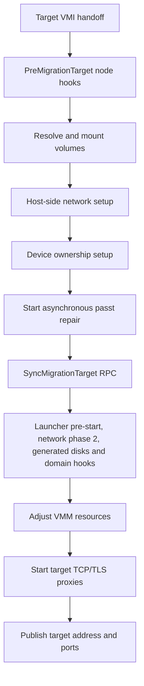
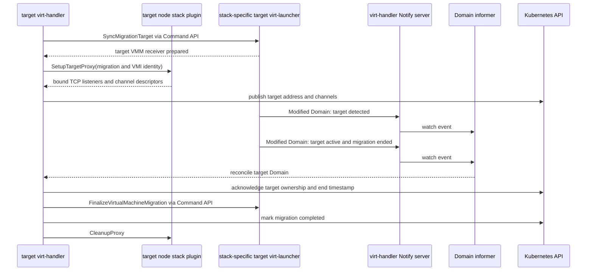

# KubeVirt Live Migration Workflow

## Purpose

KubeVirt live migration moves a running `VirtualMachineInstance` (VMI) from its current `virt-launcher` pod and node to a newly scheduled target `virt-launcher` pod, while preserving the guest's running state. KubeVirt coordinates Kubernetes resources and status; `virt-handler` prepares both nodes and provides authenticated proxy paths; source `virt-launcher` asks libvirt to perform the migration; libvirt/QEMU transfers guest state and, for block migration, selected disk data.

## Scope

This document follows the normal, same-cluster workflow initiated by `virtctl migrate <vm>`:

- **Entry point:** `virtctl` calls the VM `migrate` subresource, which creates a `VirtualMachineInstanceMigration` (VMIM).
- **End point:** the target launcher owns an active domain, `VMI.status.nodeName` identifies the target node, `VMI.status.migrationState.completed` is true, and `VMIM.status.phase` is `Succeeded`; or the same state objects record failure/abort.
- **Included:** VMIM admission, migration-controller scheduling and handoff, target and source `virt-handler`, launcher RPCs, migration proxies, libvirt invocation, state transfer, status acknowledgement, failure, abort, and cleanup.
- **Conditional paths included:** block migration, hotplug volumes, backend storage, post-copy/forced convergence, migration policies, paused guests, TLS disablement, and decentralized migration where it changes this path.
- **Excluded:** automatic migration creation by evacuation/workload-update controllers, detailed CNI implementation, Kubernetes scheduler internals, CSI data-plane behavior, and libvirt/QEMU's internal migration protocol.

Generated clients, Kubernetes admission/scheduling, CNI/CSI, and libvirt/QEMU are external or generated boundaries. The repository proves how KubeVirt invokes and observes them, not their internal execution.

## Executive Summary

`virtctl migrate` POSTs `MigrateOptions` to the VM migrate subresource. `virt-api` verifies that the VM and running VMI exist and creates a VMIM. Admission adds a selector label and finalizer, rejects a finalized/non-migratable VMI or a conflicting in-flight migration, and persists the VMIM.

The migration controller advances the VMIM through `Pending`, `Scheduling`, `Scheduled`, `PreparingTarget`, `TargetReady`, `Running`, and a final phase. It creates a target launcher pod derived from the source pod, constrains it away from the source node, waits for readiness, and writes source/target identity and matched migration configuration into `VMI.status.migrationState`. Adding the target-node label is the handoff signal to the target node's `virt-handler`.

Target `virt-handler` mounts target-side disks, configures migration-target networking and device ownership, calls target `virt-launcher` to construct the destination domain environment, then starts TCP listeners which forward into the target launcher's Unix sockets. It publishes the target node address and dynamically allocated ports in VMI status. Source `virt-handler` consumes those values, creates Unix-to-TCP proxies in the source launcher's mount namespace, assembles migration options, and calls source `virt-launcher`.

Source `virt-launcher` invokes libvirt `MigrateToURI3`. The control connection and migration streams enter source Unix sockets, traverse `virt-handler` TLS/TCP proxies between nodes, and terminate at target Unix sockets. QEMU normally pre-copies memory while the guest runs, briefly switches over execution, and optionally copies non-shared disks. Policy may permit post-copy, auto-convergence, compression, parallel channels, or workload disruption. Target `virt-handler` observes the active destination domain, transfers VMI ownership to the target, finalizes target devices/network, and marks migration complete; the migration controller then marks the VMIM succeeded and removes its finalizer.

## Key Components

| Component | File and symbol | Responsibility |
| --- | --- | --- |
| `virtctl migrate` | [`NewMigrateCommand`, `migrateRun`](../../pkg/virtctl/vm/migrate.go#L41-L78) | Builds `MigrateOptions` and invokes the VM migrate subresource. |
| VM migrate REST handler | [`SubresourceAPIApp.MigrateVMRequestHandler`](../../pkg/virt-api/rest/lifecycle.go#L523-L571) | Checks for a running VMI and creates the VMIM. |
| VMIM API/status | [`VirtualMachineInstanceMigrationState`, `VirtualMachineInstanceMigrationSpec`, `VirtualMachineInstanceMigrationStatus`](../../staging/src/kubevirt.io/api/core/v1/types.go#L990-L1060) | Carries orchestration phase, node/pod identity, endpoint, policy, progress, and result state. |
| VMIM admission | [`MigrationCreateMutator.Mutate`](../../pkg/virt-api/webhooks/mutating-webhook/mutators/migration-create-mutator.go#L34-L71), [`MigrationCreateAdmitter.Admit`](../../pkg/virt-api/webhooks/validating-webhook/admitters/migration-create-admitter.go#L94-L178) | Adds metadata and rejects invalid, conflicting, or non-migratable requests. |
| Migration controller | [`Controller.execute`, `Controller.sync`, `Controller.processMigrationPhase`](../../pkg/virt-controller/watch/migration/migration.go#L369-L422) | Creates and tracks the target pod, hands migration to handlers, and owns VMIM phase transitions. |
| Target `virt-handler` | [`MigrationTargetController.processVMI`](../../pkg/virt-handler/migration-target.go#L856-L986) | Prepares target volumes/network/devices/launcher and exposes migration listeners. |
| Source `virt-handler` | [`MigrationSourceController.migrateVMI`](../../pkg/virt-handler/migration-source.go#L488-L608) | Creates source proxies, resolves migration configuration, and starts launcher migration. |
| Migration proxy manager | [`StartTargetListener`, `StartSourceListener`](../../pkg/virt-handler/migration-proxy/migration-proxy.go#L131-L331) | Bridges launcher Unix sockets over optional-TLS TCP between nodes. |
| Target `virt-launcher` | [`LibvirtDomainManager.prepareMigrationTarget`](../../pkg/virt-launcher/virtwrap/live-migration-target.go#L157-L281) | Generates target domain configuration, metadata, hook output, and destination sockets/direct proxies. |
| Source `virt-launcher` | [`startMigration`, `migrateHelper`, `migrate`](../../pkg/virt-launcher/virtwrap/live-migration-source.go#L287-L304) | Starts asynchronous monitoring and calls libvirt to move guest state. |
| Target completion | [`MigrationTargetController.updateStatus`, `finalizeMigration`](../../pkg/virt-handler/migration-target.go#L313-L429) | Detects the migrated domain, transfers ownership, finalizes target state, and sets `Completed`. |

## Entry Points

### User-facing VM subresource

[`NewMigrateCommand`](../../pkg/virtctl/vm/migrate.go#L41-L58) registers `virtctl migrate (VM)`. [`migrateRun`](../../pkg/virtctl/vm/migrate.go#L60-L78) resolves the namespace/client, constructs `MigrateOptions` from `--dry-run` and `--addedNodeSelector`, and calls `VirtualMachine(namespace).Migrate(...)`. The generated/typed client's [`virtualMachines.Migrate`](../../staging/src/kubevirt.io/client-go/kubevirt/typed/core/v1/virtualmachine_expansion.go#L119-L129) performs the subresource request.

[`MigrateVMRequestHandler`](../../pkg/virt-api/rest/lifecycle.go#L523-L571) decodes those options, fetches both VM and VMI, requires `VMI.status.phase == Running`, and creates a VMIM whose generated name starts with `kubevirt-migrate-vm-`, whose `spec.vmiName` identifies the workload, and whose `spec.addedNodeSelector` carries one-off restrictions. A dry run is passed to Kubernetes `CreateOptions`; a dry-run request therefore does not start this workflow.

### Direct VMIM API

A client may create a VMIM directly. The API shape is defined by [`VirtualMachineInstanceMigrationSpec`](../../staging/src/kubevirt.io/api/core/v1/types.go#L1788-L1810). This bypasses the VM subresource's explicit running-phase check, but not VMIM admission or the controller's runtime checks.

## End-to-End Workflow

1. **The user requests migration.**
   - **File and symbol:** [`migrateCommand.migrateRun`](../../pkg/virtctl/vm/migrate.go#L60-L78).
   - **Important inputs/state:** VM name, namespace, optional `AddedNodeSelector`, optional dry run.
   - **Decision/transformation:** Converts CLI flags to `MigrateOptions` and invokes the VM subresource.
   - **Next step:** `virt-api` receives the request.

2. **`virt-api` creates a migration job.**
   - **File and symbol:** [`SubresourceAPIApp.MigrateVMRequestHandler`](../../pkg/virt-api/rest/lifecycle.go#L523-L571).
   - **Important inputs/state:** Existing VM and VMI; VMI must be `Running`.
   - **Decision/transformation:** Creates a VMIM with `spec.vmiName` and the optional selector; returns HTTP 202 after API creation succeeds.
   - **Next step:** Kubernetes admission processes VMIM creation.

3. **Admission enriches and validates the VMIM.**
   - **File and symbol:** [`MigrationCreateMutator.Mutate`](../../pkg/virt-api/webhooks/mutating-webhook/mutators/migration-create-mutator.go#L34-L71), [`MigrationCreateAdmitter.Admit`](../../pkg/virt-api/webhooks/validating-webhook/admitters/migration-create-admitter.go#L94-L178).
   - **Important inputs/state:** VMIM schema, referenced VMI, `IsMigratable` condition, existing VMIMs carrying the selector label.
   - **Decision/transformation:** Adds `MigrationSelectorLabel=<vmiName>` and `VirtualMachineInstanceMigrationFinalizer`; rejects missing/final VMI, a false migratable condition, or another non-final migration.
   - **Next step:** The migration-controller informer queues the accepted VMIM.

4. **The migration controller accepts and throttles the job.**
   - **File and symbol:** [`Controller.execute`](../../pkg/virt-controller/watch/migration/migration.go#L369-L422), [`Controller.processMigrationPhase`](../../pkg/virt-controller/watch/migration/migration.go#L716-L843), [`Controller.handleTargetPodCreation`](../../pkg/virt-controller/watch/migration/migration.go#L1346-L1414).
   - **Important inputs/state:** VMIM phase, current VMI migration state, global and source-node parallel limits, backup/utility-volume state.
   - **Decision/transformation:** `Unset` becomes `Pending` if no migration owns the VMI. Pending work waits for backup/utility constraints and capacity. User-triggered migrations do not use evacuation backoff.
   - **Next step:** Render and create a target launcher pod.

5. **The controller creates and schedules the target pod.**
   - **File and symbol:** [`Controller.createTargetPod`](../../pkg/virt-controller/watch/migration/migration.go#L938-L1051).
   - **Important inputs/state:** Source launcher pod, VMI, VMIM selector, CPU model/vendor, SELinux level, migration backend-storage need.
   - **Decision/transformation:** `RenderMigrationManifest` derives a target pod; anti-affinity excludes the source node; VM constraints take precedence when selectors collide; CPU compatibility and SELinux constraints are added. Backend-state PVC and hotplug attachment pod are created when required.
   - **Next step:** Kubernetes schedules the pod; controller phases advance `Pending → Scheduling → Scheduled` after required pods are ready.

6. **The controller hands the VMI to target `virt-handler`.**
   - **File and symbol:** [`Controller.sync`](../../pkg/virt-controller/watch/migration/migration.go#L1805-L1934), [`Controller.handleTargetPodHandoff`](../../pkg/virt-controller/watch/migration/migration.go#L1199-L1284).
   - **Important inputs/state:** Ready target pod, source node/pod, migration UID, target node/pod, policy and attachment metadata.
   - **Decision/transformation:** Writes `VMI.status.migrationState`, matches migration policy, and adds `MigrationTargetNodeNameLabel=<target-node>`. This label causes the target node's VMI informer/controller to recognize itself as target.
   - **Next step:** Target `MigrationTargetController` prepares local resources.

7. **Target `virt-handler` prepares host and launcher resources.**
   - **File and symbol:** [`MigrationTargetController.execute`](../../pkg/virt-handler/migration-target.go#L647-L717), [`MigrationTargetController.processVMI`](../../pkg/virt-handler/migration-target.go#L856-L986).
   - **Important inputs/state:** Target label, VMI migration method/transport, mounted target pod, migrated-volume status, hotplug attachment UID, network bindings.
   - **Decision/transformation:** Mounts container/hotplug disks, replaces migrated PVC metadata where needed, configures only migration-target networks, sets device ownership, runs pre-target node hooks, repairs passt state when enabled, then calls `SyncMigrationTarget` on target launcher.
   - **Next step:** Target launcher generates the destination domain environment.

8. **Target `virt-launcher` constructs the destination side.**
   - **File and symbol:** [`Launcher.SyncMigrationTarget`](../../pkg/virt-launcher/virtwrap/cmd-server/server.go#L203-L224), [`LibvirtDomainManager.prepareMigrationTarget`](../../pkg/virt-launcher/virtwrap/live-migration-target.go#L157-L281).
   - **Important inputs/state:** VMI/domain conversion options, migration transport, cloud-init/generated media, hooks/plugins, CBT state, paused state.
   - **Decision/transformation:** Converts the VMI to target domain configuration, runs migration-target hooks, initializes migration metadata, creates the migration socket directory for Unix transport, and records paused state. Legacy transport instead creates launcher-local Unix-to-loopback TCP proxies.
   - **Next step:** Target `virt-handler` opens host-facing listeners.

9. **Target `virt-handler` publishes migration endpoints.**
   - **File and symbol:** [`MigrationTargetController.handleTargetMigrationProxy`](../../pkg/virt-handler/migration-target.go#L739-L763), [`migrationProxyManager.StartTargetListener`](../../pkg/virt-handler/migration-proxy/migration-proxy.go#L131-L196), [`MigrationTargetController.updateStatus`](../../pkg/virt-handler/migration-target.go#L313-L429).
   - **Important inputs/state:** Target `virtqemud` Unix socket; migration stream socket for port 49152; an additional disk stream socket for block migration on 49153.
   - **Decision/transformation:** Binds random host TCP ports, optionally with TLS, and forwards each to its target Unix socket. Publishes `TargetNodeAddress` and the external-port-to-logical-port map in VMI status.
   - **Next step:** VMIM reaches `TargetReady`; source `virt-handler` sees usable target endpoints.

10. **Source `virt-handler` builds the source side and starts migration.**
    - **File and symbol:** [`MigrationSourceController.handleSourceMigrationProxy`](../../pkg/virt-handler/migration-source.go#L462-L486), [`MigrationSourceController.migrateVMI`](../../pkg/virt-handler/migration-source.go#L488-L608).
    - **Important inputs/state:** Target address/ports, matched `VMIMConfigurationOptions`, source launcher PID/mount path, VMI migration method.
    - **Decision/transformation:** Creates source launcher-visible Unix listeners, each forwarding over optional-TLS TCP to the corresponding target port. It converts matched/default configuration to `MigrationOptions`, adds stall/downtime/compression/parallel settings when enabled, runs source hooks, and calls source launcher's `MigrateVirtualMachine` RPC.
    - **Next step:** Source launcher starts asynchronous libvirt migration.

11. **Source `virt-launcher` supplies libvirt migration parameters.**
    - **File and symbol:** [`Launcher.MigrateVirtualMachine`](../../pkg/virt-launcher/virtwrap/cmd-server/server.go#L148-L171), [`LibvirtDomainManager.startMigration`](../../pkg/virt-launcher/virtwrap/live-migration-source.go#L287-L304), [`generateMigrationParams`](../../pkg/virt-launcher/virtwrap/live-migration-source.go#L1080-L1131).
    - **Important inputs/state:** Migratable domain XML, bandwidth, target identity, source Unix socket paths, selected disks.
    - **Decision/transformation:** Stores start metadata and launches a goroutine. Parameters set destination/persistent XML, destination name, bandwidth, `unix://...-49152-source.sock` as the migration stream, and—when disks must move—`...-49153-source.sock` plus selected disk targets.
    - **Next step:** `migrateHelper` invokes libvirt.

12. **libvirt/QEMU moves control, memory, device, and optional disk state.**
    - **File and symbol:** [`generateMigrationFlags`](../../pkg/virt-launcher/virtwrap/live-migration-source.go#L135-L163), [`LibvirtDomainManager.migrateHelper`](../../pkg/virt-launcher/virtwrap/live-migration-source.go#L1317-L1372).
    - **Important inputs/state:** `MIGRATE_LIVE`, peer-to-peer and persistent-destination flags; optional block, unsafe, auto-converge, post-copy, paused, parallel, and compression flags.
    - **Decision/transformation:** Hot-unplugs migratable host devices, then calls `dom.MigrateToURI3`. Its destination libvirt control URI is a source proxy Unix socket keyed by the VMI UID. The separate migration and disk URIs use logical ports 49152/49153. Proxying produces this verified path:
      `source libvirt/QEMU → source Unix socket → source virt-handler TCP client → target virt-handler TCP listener → target launcher Unix socket → target libvirt/QEMU`.
    - **Next step:** QEMU pre-copies while the migration monitor observes progress; `MigrateToURI3` returns success or error.

13. **The migration monitor controls convergence and records the launcher result.**
    - **File and symbol:** [`newMigrationMonitor`](../../pkg/virt-launcher/virtwrap/live-migration-source.go#L389-L453), [`migrationMonitor.processCompletionTimeouts`](../../pkg/virt-launcher/virtwrap/live-migration-source.go#L580-L627), [`LibvirtDomainManager.migrate`](../../pkg/virt-launcher/virtwrap/live-migration-source.go#L1389-L1424).
    - **Important inputs/state:** Remaining bytes, elapsed time, memory iteration/bandwidth, completion/progress deadlines, maximum downtime, policy permissions.
    - **Decision/transformation:** Monitors libvirt job statistics. Depending on configuration and convergence, it continues pre-copy, starts post-copy, raises allowed downtime/forces switchover, pauses for stop-and-copy in the legacy path, or aborts. It records `EndTimestamp`, `Failed`, `FailureReason`, mode, and abort status in domain migration metadata.
    - **Next step:** Domain informer updates let target/source handlers reconcile the result.

14. **Target `virt-handler` transfers ownership and finalizes.**
    - **File and symbol:** [`MigrationTargetController.updateStatus`](../../pkg/virt-handler/migration-target.go#L313-L429), [`ackMigrationCompletion`](../../pkg/virt-handler/migration-target.go#L278-L311), [`finalizeMigration`](../../pkg/virt-handler/migration-target.go#L1205-L1245).
    - **Important inputs/state:** Active target domain, domain migration `EndTimestamp`, pending CPU/memory/network finalization.
    - **Decision/transformation:** Records domain detection/readiness; for an active ended migration, sets VMI node identity to target and copies the end timestamp. A following reconcile hotplugs requested CPU/memory changes, reconnects interfaces where required through launcher finalization, runs target post-hooks, and sets `MigrationState.Completed=true`.
    - **Next step:** The migration controller observes completion.

15. **The controller finalizes the VMIM and resources.**
    - **File and symbol:** [`Controller.processMigrationPhase`](../../pkg/virt-controller/watch/migration/migration.go#L819-L843), [`Controller.updateStatus`](../../pkg/virt-controller/watch/migration/migration.go#L482-L639), [`MigrationTargetController.finalCleanup`](../../pkg/virt-handler/migration-target.go#L514-L573).
    - **Important inputs/state:** `MigrationState.Completed`, failure flag, pending CPU/memory/migration-required conditions, target pod annotation, backend storage.
    - **Decision/transformation:** The controller changes `Running → Succeeded` only after completion and pending change conditions clear. It copies final migration state to VMIM status and removes the VMIM finalizer. Target handler stops listeners, closes launcher clients, removes the target label, and retains the target pod as the active launcher on success. On failure it signals target-pod cleanup and tears down target mounts/network.
    - **Next step:** Old finalized VMIMs may be garbage-collected and pending migrations requeued.

## Target `virt-handler` Pre- and Post-Migration Work

Target preparation is a reconciliation workflow, not one atomic hook. [`MigrationTargetController.processVMI`](../../pkg/virt-handler/migration-target.go#L856-L986) runs host-side setup in a deliberate order, delegates pod-local preparation to target `virt-launcher`, and advertises migration endpoints only after those operations succeed. Reconciliation guards prevent this sequence from being repeated once target proxy listeners are present or migration has started. Before that point, a wait condition or error can cause the sequence—including pre-target hooks—to run again, so each operation and external hook must tolerate retries. For decentralized migration, preparation also waits until source identity and migration transport have been synchronized because they determine socket identity and whether a block-migration channel is needed.

### Pre-migration sequence on the target

The target-side order is:

1. **Run extensible pre-target node hooks.** If plugins are enabled, `virt-handler` invokes `NodeHookPreMigrationTarget` before mounting volumes or configuring networking. [`CallNodeHooks`](../../pkg/virt-handler/plugins/manager.go#L69-L133) evaluates plugin-level and hook-level CEL conditions, sorts matching hooks by plugin name, and invokes each plugin over its Unix socket. A hook may define its timeout and either fail preparation or use the ignore failure strategy. Because this hook runs first, a plugin must not assume that the target's disks, network namespace, or libvirt environment have already been prepared.

2. **Resolve and mount target storage.** [`syncVolumes`](../../pkg/virt-handler/migration-target.go#L781-L829) first substitutes destination PVC information into `VolumeStatus` for migrated volumes, then converts filesystem PVC descriptions to target host-disk paths. It waits until container disks are ready, mounts and verifies them, and mounts hotplug volumes from the target attachment pod when `TargetAttachmentPodUID` is present. Container-disk and hotplug-mount not-ready results cause a delayed retry rather than endpoint publication. Persistent volumes already mounted into the target pod by kubelet/CSI are not copied or mounted by this function; this step prepares the host-side views and supplemental mounts that `virt-launcher` expects.

3. **Configure the target pod network namespace.** `FilterNetsForMigrationTarget` currently returns all VMI networks, so every declared network is passed to [`setupNetwork`](../../pkg/virt-handler/controller.go#L363-L372). The handler detects the target launcher's PID and calls `netConf.Setup` against that pod namespace. This is the host-side/phase-1 network setup: it creates or prepares the interfaces, bridges, tap devices, caches, and binding-specific state needed before the destination domain is constructed. A failure is fatal to that preparation attempt.

4. **Assign device and file ownership.** [`setupDevicesOwnerships`](../../pkg/virt-handler/controller.go#L320-L361) enters through the target launcher's mount root and claims the selected hypervisor device and, when requested, `vhost-vsock`. It also configures host-disk permissions, SEV device ownership, non-root execution support, and virtio-fs resources. This ensures the target QEMU process can open its devices and disk paths after libvirt creates the incoming domain.

5. **Build launcher options and start passt repair.** The handler computes interface-to-domain attachment data and serializes enabled plugin data into `VirtualMachineOptions`. When passt support is enabled, [`HandleMigrationTarget`](../../pkg/network/passt/repair.go#L88-L105) starts asynchronous `passt-repair` work for a VMI that uses passt. Duplicate work is suppressed, execution is limited to 60 seconds, and errors are logged; the handler deliberately does not block target preparation on completion of this repair process.

6. **Delegate pod-local preparation to `virt-launcher`.** `SyncMigrationTarget` crosses the handler/launcher command socket and calls [`prepareMigrationTarget`](../../pkg/virt-launcher/virtwrap/live-migration-target.go#L157-L281). Inside the target pod, the launcher:
   - builds the domain-conversion context and starts the hook sidecar server;
   - prepares changed-block-tracking overlays when enabled;
   - converts the VMI into the destination libvirt domain specification;
   - runs [`preStartHook`](../../pkg/virt-launcher/virtwrap/manager.go#L948-L1057), which reads and filters cloud-init data, creates ignition and generated media, performs pod-network phase 2 against the domain specification, creates ephemeral/container/empty/config-map/secret/sysprep/downward-API/service-account disks, selects disk cache/I/O modes, starts QEMU guest-agent credential propagation, and expands eligible PVC images;
   - initializes migration metadata, creates the empty cloud-init ISO, invokes legacy `OnDefineDomain` hooks, and applies plugin domain hooks with `InvocationContextMigrationTarget`;
   - for Unix migration, creates and assigns ownership to the directory in which destination QEMU will create its migration sockets; legacy transport instead creates launcher-local Unix-to-loopback-TCP proxies;
   - verifies decentralized hotplug-disk paths and preserves the paused state when the source VMI was paused.

   These launcher hooks are distinct from the handler's node hooks: node hooks run in host plugins around the entire preparation/finalization workflow, while pre-start and domain hooks modify or prepare the target pod and libvirt domain specification.

7. **Adjust runtime resources.** After launcher preparation, `virt-handler` calls the hypervisor runtime's `AdjustResources`. The target controller calls it again when it first detects the incoming domain so that process limits such as QEMU memlock remain suitable for post-migration device hotplug.

8. **Start and publish target proxies.** Only now does [`handleTargetMigrationProxy`](../../pkg/virt-handler/migration-target.go#L748-L773) expose the target `virtqemud` control socket and the QEMU migration socket(s) through host TCP/TLS listeners. [`updateStatus`](../../pkg/virt-handler/migration-target.go#L313-L429) subsequently publishes their address and ephemeral ports. Source migration therefore cannot begin through the normal status-driven path until volume, network, device, launcher, and socket-directory preparation has completed.



### Completion acknowledgement and post-migration sequence

Post-migration work begins only after the target launcher has reported an end timestamp and the target domain is active. Target lifecycle handling waits until libvirt no longer reports an incoming migration job before setting that timestamp. [`updateStatus`](../../pkg/virt-handler/migration-target.go#L313-L380) then records domain detection/readiness and `ackMigrationCompletion` transfers VMI node identity to the target. The next reconciliation satisfies `migrationNeedsFinalization` and invokes [`finalizeMigration`](../../pkg/virt-handler/migration-target.go#L1207-L1245):

1. Pending CPU and memory changes are applied through launcher RPCs. Their errors are recorded as events but do not prevent the remaining target finalization steps.
2. The volumes-change condition and `MigratedVolumes` bookkeeping are removed. The actual target volumes remain attached and mounted because this pod is becoming the active launcher.
3. `FinalizeVirtualMachineMigration` asks the launcher to run [`finalizeMigrationTarget`](../../pkg/virt-launcher/virtwrap/live-migration-target.go#L58-L70). Interfaces whose binding migration method is `LinkRefresh` are toggled down and up to prompt guest DHCP renewal, and guest time synchronization is requested to compensate for migration downtime.
4. Changed-block-tracking state is changed to `Initializing`, when applicable, so checkpoints can be redefined on the new node.
5. Enabled plugins receive `NodeHookPostMigrationTarget`, using the same CEL matching, ordering, timeout, and failure-strategy rules as the pre-hook. Unlike CPU or memory hotplug errors, an unignored post-hook error prevents `Completed` from being set and causes reconciliation to retry.
6. Only after launcher finalization and post-target hooks succeed does the handler set `VMI.status.migrationState.completed=true`.

Final cleanup follows the persisted migration result in [`finalCleanup`](../../pkg/virt-handler/migration-target.go#L514-L573):

- **Successful migration:** the target pod is retained as the running VM. The handler performs the launcher finalization call idempotently, removes the migration-target label and target-creation annotation, closes the migration-specific launcher client, and stops the target proxy listeners. It does **not** tear down target networking or unmount target volumes.
- **Failed or aborted migration:** the handler signals the target launcher to exit, unmounts container disks and all target hotplug mounts, tears down network configuration and network-stat state, removes the target domain from its local cache, removes migration-target bookkeeping, closes the launcher client, and stops the target proxies. Failed post-copy has an additional guard: target cleanup waits while the target domain still contains the authoritative failure state needed to mark the VMI failed.

The proxy lifetime is therefore governed by migration state, not socket EOF: listeners remain available throughout transfer and abort coordination and are stopped only during final cleanup after completion or failure has been recorded.

## Data and Control Flow

The VMIM owns orchestration state; the VMI carries the cross-controller handoff state. [`VirtualMachineInstanceMigrationState`](../../staging/src/kubevirt.io/api/core/v1/types.go#L990-L1060) is the contract between migration controller, both handlers, both launchers, and—conditionally—the synchronization controller. Important ownership transitions are:

- migration controller writes migration UID, source/target pod/node, matched policy/configuration, and target label;
- target handler writes listener address/ports, target domain detection/readiness, new node ownership, and completion;
- source launcher writes migration progress/result into libvirt domain metadata;
- source handler copies source-side failure/progress metadata to VMI status;
- target handler uses target domain metadata and active state to acknowledge success;
- migration controller converts VMI completion/failure into final VMIM phase.

```mermaid
sequenceDiagram
    actor User
    participant CLI as virtctl
    participant API as virt-api / Kubernetes API
    participant MC as migration controller
    participant TH as target virt-handler
    participant TL as target virt-launcher/libvirt
    participant SH as source virt-handler
    participant SL as source virt-launcher/libvirt

    User->>CLI: virtctl migrate VM
    CLI->>API: POST VM migrate subresource
    API->>API: create and admit VMIM
    MC->>API: create target virt-launcher pod
    API-->>MC: target pod Ready
    MC->>API: patch VMI migrationState + target-node label
    API-->>TH: target VMI update
    TH->>TL: SyncMigrationTarget
    TL-->>TH: target domain environment prepared
    TH->>TH: open TCP-to-Unix target proxies
    TH->>API: publish address and ports
    API-->>SH: target endpoint update
    SH->>SH: open Unix-to-TCP source proxies
    SH->>SL: MigrateVirtualMachine
    SL->>TL: MigrateToURI3 through handler proxies
    Note over SL,TL: QEMU transfers memory/device state and optional disks
    TL-->>TH: active domain + migration metadata
    TH->>API: target ownership, EndTimestamp, Completed
    API-->>MC: completed migrationState
    MC->>API: VMIM Succeeded; remove finalizer
```

### Actual data path

[`GetMigrationPortsList`](../../pkg/virt-handler/migration-proxy/migration-proxy.go#L105-L112) selects logical migration port 49152 and, for block migration, disk port 49153. Target listeners bind ephemeral host ports and publish a map whose values retain those logical roles. [`StartSourceListener`](../../pkg/virt-handler/migration-proxy/migration-proxy.go#L258-L331) reconstructs matching source socket names and connects each to the advertised target endpoint.

TLS is terminated by the handler proxies, not by QEMU. [`StartTargetListener`](../../pkg/virt-handler/migration-proxy/migration-proxy.go#L131-L196) and [`StartSourceListener`](../../pkg/virt-handler/migration-proxy/migration-proxy.go#L258-L331) set their TLS configurations to nil only when `MigrationConfiguration.DisableTLS` is true.

For shared-storage live migration, QEMU transfers runtime state and generated/local disks selected by [`getDiskTargetsForMigration`](../../pkg/virt-launcher/virtwrap/live-migration-source.go#L253-L285); shared PVC disks are excluded. For block migration, `MIGRATE_NON_SHARED_INC`, `MigrateDisks`, and `DisksURI` cause selected non-shared disk contents to move as part of libvirt migration. Storage implementation below those file/block paths is outside KubeVirt.

## Worked Example

**Illustrative input grounded in the CLI and controller tests:** migrate running VM `test-vm` while restricting the one-off target to `zone=west`.

1. `virtctl migrate test-vm --addedNodeSelector zone=west` is parsed by [`migrateRun`](../../pkg/virtctl/vm/migrate.go#L60-L78) into `MigrateOptions{AddedNodeSelector: {"zone":"west"}}`. The option encoding is exercised by [`migrate_test.go`](../../pkg/virtctl/vm/migrate_test.go#L56-L84).
2. [`MigrateVMRequestHandler`](../../pkg/virt-api/rest/lifecycle.go#L523-L571) creates a generated-name VMIM with `spec.vmiName: test-vm` and that selector.
3. Admission adds the VMI selector label and finalizer. Assuming the VMI is running, not finalized, migratable, and has no active VMIM, creation is accepted.
4. [`createTargetPod`](../../pkg/virt-controller/watch/migration/migration.go#L938-L1051) merges `zone=west` with the rendered pod selector. Existing VM constraints win on key collision, so this option can restrict but cannot bypass VM placement rules. The controller test [`should create target pod merging addedNodeSelector...`](../../pkg/virt-controller/watch/migration/migration_test.go#L912-L1004) verifies this behavior.
5. The Kubernetes scheduler selects a compatible non-source node. The exact node and timing are runtime-dependent. When its target pod is ready, [`handleTargetPodHandoff`](../../pkg/virt-controller/watch/migration/migration.go#L1199-L1284) records that node and pod in VMI status.
6. Target handler mounts/configures resources and target launcher prepares Unix socket paths. Target handler exposes one TCP listener for a normal shared-storage migration and publishes its ephemeral port and node address.
7. Source handler creates its source Unix proxy and sends options to source launcher. [`generateMigrationParams`](../../pkg/virt-launcher/virtwrap/live-migration-source.go#L1080-L1131) finds no non-shared disks in this example, so it sets the memory/state URI but no `DisksURI`.
8. [`migrateHelper`](../../pkg/virt-launcher/virtwrap/live-migration-source.go#L1317-L1372) calls `MigrateToURI3` with live, peer-to-peer, persistent-destination flags plus options selected by cluster defaults/policy. QEMU transfers memory/device state through the proxy path. If pre-copy converges, it briefly switches execution to the target and completes.
9. Target handler observes an active ended domain, changes `VMI.status.nodeName` to the selected west-zone node, finalizes target state, and sets `Completed`. The migration controller sets VMIM phase to `Succeeded`.

If this VM instead had non-shared volumes selected in `VMI.status.migratedVolumes`, the same example would use block migration: a second proxied channel and `MIGRATE_NON_SHARED_INC` would carry those disk contents.

## Important Branches and Failure Paths

- **Admission rejection:** [`isMigratable`](../../pkg/virt-api/webhooks/validating-webhook/admitters/migration-create-admitter.go#L52-L67) rejects an explicit false migratable condition; [`ensureNoMigrationConflict`](../../pkg/virt-api/webhooks/validating-webhook/admitters/migration-create-admitter.go#L69-L92) rejects another non-final VMIM for the VMI.
- **Placement and capacity:** [`handleTargetPodCreation`](../../pkg/virt-controller/watch/migration/migration.go#L1346-L1414) waits on cluster-wide and per-source-node parallel limits. [`handlePendingPodTimeout`](../../pkg/virt-controller/watch/migration/migration.go#L1729-L1788) deletes a target pod after configured unschedulable or catch-all pending timeouts, allowing reconciliation to retry creation.
- **Backup and utility volumes:** [`handleVMBackup`](../../pkg/virt-controller/watch/migration/migration.go#L1555-L1600) waits for backup except that system-critical migration requests abort it. [`handleUtilityVolumes`](../../pkg/virt-controller/watch/migration/migration.go#L1646-L1727) waits and eventually fails if utility volumes remain attached.
- **Hotplug volumes:** target pod readiness is not enough; the controller creates and waits for an attachment pod, then target handler mounts from its UID before launcher preparation.
- **Backend state:** persistent TPM/EFI state may require a target backend PVC. Controller creates it before the target pod and calls `backendstorage.MigrationHandoff` after the target domain becomes ready.
- **Block versus shared-storage migration:** [`generateMigrationFlags`](../../pkg/virt-launcher/virtwrap/live-migration-source.go#L135-L163) adds `MIGRATE_NON_SHARED_INC`; [`generateMigrationParams`](../../pkg/virt-launcher/virtwrap/live-migration-source.go#L1080-L1131) adds disk targets and a second URI only when selected disks must move.
- **Migration policy/defaults:** [`Controller.matchMigrationPolicy`](../../pkg/virt-controller/watch/migration/migration.go#L2629-L2668) stores a matched policy and effective options in VMI migration state. Source handler consumes that snapshot rather than assuming current defaults.
- **Pre-copy convergence:** auto-converge, post-copy, workload disruption, max downtime, completion timeout, stall detection, compression, and parallel channels are conditional flags/options. [`processCompletionTimeouts`](../../pkg/virt-launcher/virtwrap/live-migration-source.go#L580-L627) will use post-copy only when allowed, not VFIO, and estimated completable; otherwise it may force downtime or abort. In post-copy the target is already executing while remaining pages are fetched, so later network/source failure can be fatal.
- **Paused VMI:** `generateMigrationFlags` adds `MIGRATE_PAUSED`, and target preparation records that the target should remain paused.
- **TLS disabled:** only the `DisableTLS` migration setting disables TLS on inter-node handler proxy connections; Unix launcher-facing legs remain local sockets.
- **Cancellation:** deleting an unhanded VMIM removes its target pod. After handoff, [`Controller.sync`](../../pkg/virt-controller/watch/migration/migration.go#L1924-L1930) sets `AbortRequested`; [`MigrationSourceController.handleMigrationAbort`](../../pkg/virt-handler/migration-source.go#L662-L689) calls launcher cancellation and deduplicates in-progress/succeeded aborts.
- **Launcher/libvirt failure:** [`migrate`](../../pkg/virt-launcher/virtwrap/live-migration-source.go#L1389-L1424) records failure metadata; source handler propagates failure to VMI migration state, and controller sets VMIM `Failed`.
- **Target disappears:** migration controller fails/interupts when the target pod dies or disappears. Before migration starts it patches VMI completion/failure; after start it also requests cancellation/cleanup.
- **Success acknowledgement timeout:** [`MigrationSourceController.hasTargetDetectedReadyDomain`](../../pkg/virt-handler/migration-source.go#L147-L184) allows 60 seconds after the end timestamp for target-domain detection; if no target can be confirmed, source handling marks the VMI failed rather than silently transferring ownership.
- **Post-copy target failure:** [`MigrationTargetController.finalCleanup`](../../pkg/virt-handler/migration-target.go#L514-L573) preserves a failed post-copy target domain long enough for VMI-level failure to be recorded before cleanup.
- **Decentralized migration:** `spec.sendTo`/`spec.receive` requires the `DecentralizedLiveMigration` feature gate and adds source/target synchronization-controller state. Pod setup, handler proxies, and launcher migration remain analogous, but separate VMI UIDs/namespaces and status synchronization alter identity and handoff. This document does not trace the synchronization-controller gRPC protocol in detail.

## VMM Coupling and Adapting the Flow to Cloud Hypervisor

The high-level KubeVirt workflow is not intrinsically tied to libvirt or QEMU. Creating a migration object, scheduling a destination pod, publishing source/target identity, waiting until the receiver is ready, initiating transfer, transferring ownership, and cleaning up are general orchestration operations. Likewise, the migration proxy is an opaque byte-stream bridge: it does not interpret QEMU migration data.

The current implementation is nevertheless coupled to libvirt/QEMU at multiple layers. That coupling is strongest in `virt-launcher`, but several assumptions also exist in `virt-handler` and in the status protocol consumed by `virt-controller`.

### Coupling outside `virt-launcher`

| Area | Current implementation | Coupling and consequence |
| --- | --- | --- |
| VMIM scheduling and phase state machine | [`Controller.processMigrationPhase`](../../pkg/virt-controller/watch/migration/migration.go#L716-L843) and [`Controller.handleTargetPodHandoff`](../../pkg/virt-controller/watch/migration/migration.go#L1199-L1284) | Mostly VMM-neutral. The controller needs a ready target pod and a status contract for target readiness, start, completion, and failure. Names such as `TargetNodeDomainDetected` expose the existing libvirt-domain model, but their orchestration meaning can be generalized to “target VMM instance detected/ready.” |
| Target pod construction | [`Controller.createTargetPod`](../../pkg/virt-controller/watch/migration/migration.go#L938-L1051) through `templateService.RenderMigrationManifest` | Scheduling, anti-affinity, CPU compatibility, SELinux, volumes, and resource limits are generic. The rendered container image, command, sockets, probes, and shared directories are launcher/VMM-specific and would need a Cloud Hypervisor target-pod implementation. |
| Target activation signal | [`Controller.handleTargetPodHandoff`](../../pkg/virt-controller/watch/migration/migration.go#L1199-L1284) sets `MigrationTargetNodeNameLabel` | VMM-neutral. It atomically publishes migration identity/configuration and tells the selected node's target handler to prepare. A different VMM can reuse this handoff contract. |
| Handler-to-launcher control RPC | [`MigrationTargetController.processVMI`](../../pkg/virt-handler/migration-target.go#L856-L986) calls `SyncMigrationTarget`; [`MigrationSourceController.migrateVMI`](../../pkg/virt-handler/migration-source.go#L488-L608) calls `MigrateVirtualMachine` | The source/target command pattern is generic, but the current payload and implementation assume a libvirt-managed VMI. A Cloud Hypervisor backend needs equivalent prepare, send, cancel, finalize, and status operations. |
| Target proxy destinations | [`MigrationTargetController.handleTargetMigrationProxy`](../../pkg/virt-handler/migration-target.go#L739-L763) | Explicitly libvirt/QEMU-specific: the first target is `libvirt/virtqemud-sock`; additional socket names are derived from QEMU/libvirt logical migration ports. Cloud Hypervisor would supply its receiver socket or use native TCP instead. |
| Proxy channel model | [`GetMigrationPortsList`](../../pkg/virt-handler/migration-proxy/migration-proxy.go#L105-L112) | Port 49152 represents the libvirt direct-migration stream and 49153 the libvirt block-migration stream. The proxy implementation is generic, but this fixed channel discovery and naming are not. A VMM-neutral API should describe channels/endpoints rather than infer them from `IsBlockMigration()`. |
| Inter-node TLS | [`migrationProxyManager.StartTargetListener`](../../pkg/virt-handler/migration-proxy/migration-proxy.go#L131-L196) and [`StartSourceListener`](../../pkg/virt-handler/migration-proxy/migration-proxy.go#L258-L331) | VMM-neutral. TLS wraps opaque TCP streams between handlers. It can protect any stream protocol, provided neither proxy changes framing and the VMM can use the Unix endpoints. |
| Source progress and completion input | [`MigrationSourceController.setMigrationProgressStatus`](../../pkg/virt-handler/migration-source.go#L192-L219) | Coupled to KubeVirt migration metadata embedded in the observed libvirt `api.Domain`. Cloud Hypervisor progress/result must come from its API or another launcher status channel and be translated into `VMI.status.migrationState`. |
| Target readiness and ownership transfer | [`MigrationTargetController.updateStatus`](../../pkg/virt-handler/migration-target.go#L313-L429) and [`ackMigrationCompletion`](../../pkg/virt-handler/migration-target.go#L278-L311) | Coupled to target `api.Domain` existence, active state, and libvirt migration metadata. A Cloud Hypervisor backend must prove that the receiver VM is active and that migration ended successfully before changing `VMI.status.nodeName`. |
| Abort and cleanup orchestration | [`Controller.sync`](../../pkg/virt-controller/watch/migration/migration.go#L1805-L1934), [`MigrationSourceController.handleMigrationAbort`](../../pkg/virt-handler/migration-source.go#L662-L689), and [`MigrationTargetController.finalCleanup`](../../pkg/virt-handler/migration-target.go#L514-L573) | Controller-level cancellation and cleanup are generic. Detecting/aborting the active job and preserving authoritative post-copy state are VMM-specific. |

The core transfer code inside `virt-launcher` is directly libvirt/QEMU-specific: [`generateMigrationFlags`](../../pkg/virt-launcher/virtwrap/live-migration-source.go#L135-L163) creates libvirt flags, [`generateMigrationParams`](../../pkg/virt-launcher/virtwrap/live-migration-source.go#L1080-L1131) creates `DomainMigrateParameters` and libvirt/QEMU socket URIs, [`migrateHelper`](../../pkg/virt-launcher/virtwrap/live-migration-source.go#L1317-L1372) invokes `MigrateToURI3`, and the migration monitor consumes libvirt `DomainJobInfo` and calls operations such as `MigrateStartPostCopy`, `MigrateSetMaxDowntime`, and `AbortJob`. These operations cannot be reused unchanged for another VMM.

### Why the proxy and TLS approach is reusable

The proxy implementation only connects byte streams:

```text
source VMM local socket
   -> source virt-handler Unix-to-TCP proxy
   -> optional mutual-TLS TCP connection
   -> target virt-handler TCP-to-Unix proxy
   -> target VMM local socket
```

[`NewSourceProxy`](../../pkg/virt-handler/migration-proxy/migration-proxy.go#L348-L363) exposes a Unix listener and opens TCP to the target. [`NewTargetProxy`](../../pkg/virt-handler/migration-proxy/migration-proxy.go#L366-L383) accepts TCP and connects to a target Unix socket. The migration protocol remains end-to-end between VMM instances; the proxies supply reachability, authentication, and encryption without parsing that protocol.

This pattern therefore works for a VMM that can send and receive migration over Unix stream sockets. It does not make migration formats interoperable: a Cloud Hypervisor receiver cannot consume a QEMU migration stream, and source/target VMM versions still have to be migration-compatible.

### Cloud Hypervisor transport fit

Cloud Hypervisor's upstream [Live Migration documentation](https://github.com/cloud-hypervisor/cloud-hypervisor/blob/main/docs/live_migration.md) describes both capabilities needed for either integration model:

- `receive-migration receiver_url=unix:<socket>` paired with `send-migration destination_url=unix:<socket>`;
- remote Unix-socket migration tunneled through TCP proxies such as `socat`, which is structurally equivalent to KubeVirt's handler proxies;
- direct `tcp:<host>:<port>` migration;
- mutual TLS for direct TCP migration through `tls_dir` on sender and receiver;
- pre-copy/post-copy selection, downtime and timeout controls, and parallel TCP connections.

Cloud Hypervisor's native direct-TCP and mTLS support means KubeVirt could either retain its existing security boundary or let the VMM own network security.

### Adaptation option A: retain `virt-handler` proxies

This option most closely preserves KubeVirt's current architecture:

1. The migration controller reuses VMIM admission, target scheduling, handoff, phase transitions, and cleanup.
2. The target launcher starts an empty Cloud Hypervisor process and invokes its receive-migration API with a Unix receiver URL.
3. Target `virt-handler` discovers that Unix socket from a VMM-specific endpoint descriptor, opens a TCP/TLS listener through the existing proxy manager, and publishes the address/port in migration status.
4. Source `virt-handler` creates a matching launcher-visible Unix-to-TCP proxy.
5. Source launcher invokes Cloud Hypervisor's send-migration API with the source proxy's Unix socket as `destination_url`.
6. The launcher or handler polls/receives Cloud Hypervisor migration state and translates start, progress, mode, completion, failure, and cancellation into the existing VMI migration status contract.
7. Target ownership changes only after the Cloud Hypervisor receiver reports success and the destination VM is confirmed running; target-specific network finalization and cleanup then run.

This keeps certificates and node-network exposure in `virt-handler`, preserves KubeVirt's dynamically allocated ports, and lets the VMM see only local Unix sockets. It requires replacing the hard-coded `virtqemud` and 49152/49153 channel assumptions with VMM-provided endpoint descriptions. Cloud Hypervisor's documented local Unix migration does not support its multi-connection option, so retaining Unix tunneling may also forgo that optimization unless Cloud Hypervisor adds or exposes a compatible multi-stream Unix arrangement.

### Adaptation option B: use Cloud Hypervisor native TCP/mTLS

The target launcher can instead invoke `receive-migration` on an allocated TCP endpoint with `tls_dir`, and the source can invoke `send-migration` against it. In this model the data-plane handler proxies are omitted, but KubeVirt must add orchestration for:

- safe target port allocation and publication;
- certificate/key issuance, mounting, rotation, and deletion on both launcher pods;
- NetworkPolicy/firewall exposure and target-address selection;
- receiver readiness before starting the sender;
- mapping Cloud Hypervisor's parallel-connection and post-copy requirements to allowed network endpoints;
- preventing direct VMM listener exposure beyond the intended source;
- collecting completion/failure independently from connection closure.

This removes proxy hops and permits native Cloud Hypervisor transport features, but moves the migration trust boundary and key material into the launcher/VMM environment.

### Required control-plane abstraction

A second VMM should not be introduced by scattering VMM checks through the migration controller. The existing flow suggests a driver boundary with operations equivalent to:

| Driver operation | Current libvirt/QEMU realization | Cloud Hypervisor realization |
| --- | --- | --- |
| Prepare target | `SyncMigrationTarget` converts VMI to domain state and prepares libvirt/QEMU sockets | Start empty Cloud Hypervisor and invoke `receive-migration` |
| Describe target endpoints | Handler derives `virtqemud` plus 49152/49153 Unix sockets | Return receiver Unix socket(s), or native TCP listener details |
| Start source | `MigrateVirtualMachine` eventually invokes `MigrateToURI3` | Invoke `send-migration` with destination URL and mapped options |
| Report progress/mode | Libvirt `DomainJobInfo` and migration metadata | Translate Cloud Hypervisor API state/progress into the KubeVirt status model |
| Request convergence | `MigrateStartPostCopy`, max-downtime tuning, auto-converge | Select/configure Cloud Hypervisor `memory_mode`, `downtime_ms`, timeout, and supported runtime controls |
| Cancel | Libvirt `AbortJob` | Invoke Cloud Hypervisor's supported cancellation/timeout path and confirm source remains authoritative |
| Confirm target active | Target libvirt domain event/state | Confirm destination Cloud Hypervisor VM is running after successful receive |
| Finalize | Reconnect interfaces, hotplug changes, hooks, ownership update | Perform Cloud Hypervisor-specific network/device finalization, then ownership update |
| Cleanup | Stop proxies/launcher client and remove failed target resources | Stop chosen transport/listeners, remove credentials, and destroy the losing VMM instance |

The reusable controller contract should remain expressed in outcomes—target prepared, endpoints available, transfer started, target active, completed, failed, or aborted—rather than libvirt concepts. VMM-specific drivers must preserve the current safety invariant: a successful source API return alone is insufficient; KubeVirt transfers ownership only after independently confirming a viable target VM and completing target finalization.

### Pluggable launcher, node plugin, and the existing Domain APIs

Supporting another virtualization stack requires two distinct extension points with different responsibilities:

- The **pluggable `virt-launcher` image** is the per-VMI runtime implementation. A homogeneous cluster selects a launcher image built for libvirt/QEMU or Cloud Hypervisor. Each implementation exposes the existing handler/launcher **Command API**, including `SyncMigrationTarget`, `MigrateVirtualMachine`, `CancelVirtualMachineMigration`, `FinalizeVirtualMachineMigration`, and `GetDomain`. It also acts as a client of the existing **Notify API** and projects native VMM state into KubeVirt's `api.Domain` model.
- The **node stack plugin** is a separate DaemonSet pod used by `virt-handler` for stack-specific node operations. It does not replace `virt-launcher`, implement `GetDomain`, or originate normal Domain notifications. A migration operation suitable for this plugin is setting up stack-specific source/target proxy topology and returning the opened TCP listeners or local endpoint mapping to `virt-handler`.

Retaining the term **Domain** is useful: it becomes KubeVirt's stack-neutral observation of a VMI runtime rather than necessarily a libvirt domain. The Cloud Hypervisor launcher implements `GetDomain` by querying or caching Cloud Hypervisor state and translating it into `api.Domain`; the libvirt/QEMU launcher continues to construct the same object from libvirt. Consequently, the Domain watcher and its restart-resync path remain structurally unchanged: [`domainWatcher.handleResync`](../../pkg/virt-handler/cache/domain-watcher.go#L153-L181) calls `GetDomain` on each per-VMI launcher command socket regardless of which stack-specific launcher image serves that socket.

The Notify direction also remains unchanged. The service is hosted by `virt-handler` in [`notify-server.RunServer`](../../pkg/virt-handler/notify-server/server.go#L125-L180). Each stack-specific launcher is the runtime-side client and sends `Added`, `Modified`, `Deleted`, or `Error` events through [`Notify.HandleDomainEvent`](../../pkg/virt-handler/notify-server/server.go#L54-L92), using [`notify.proto`](../../pkg/handler-launcher-com/notify/v1/notify.proto). The node plugin does not need access to the Domain notify socket. `virt-handler` remains responsible for the VMI migration-status fields it manages and translates launcher-produced Domain observations into those fields; the migration controller remains responsible for VMIM status.

For live migration, each launcher implementation must emit and return a Domain projection containing at least:

| Domain field | Meaning expected by current migration reconciliation |
| --- | --- |
| `ObjectMeta.namespace`, `name`, and `uid` | Select the VMI and reject stale observations from an earlier VMI with the same name. |
| `Spec.Metadata.KubeVirt.UID` | Correlates the runtime instance with the VMI. |
| `Status.Status` | Reports whether the source or target runtime is running, paused, shut off, or failed. |
| `Status.Reason` | Distinguishes intentional user pause and successful source relinquishment (`Shutoff` with `ReasonMigrated`) from failure. |
| `Spec.Metadata.KubeVirt.Migration.UID` | Correlates the observation with the active migration attempt. |
| `Migration.StartTimestamp` | Announces that source transfer started. |
| `Migration.EndTimestamp` | Announces that the stack considers transfer ended; on the target this must not be emitted until the receive operation is no longer active. |
| `Migration.Failed`, `FailureReason`, and `AbortStatus` | Carries terminal error and cancellation results. |
| `Migration.Mode` | Reports pre-copy, post-copy, or another normalized KubeVirt migration mode. |

The target launcher sends a `Modified` Domain event when the destination VM is detected, when it becomes active or intentionally user-paused, and when the receive operation reaches a terminal result. With the current controller semantics, success is acknowledged only when the target Domain is active and its migration metadata has an end timestamp. The source launcher reports start/progress metadata and eventually either failure or a source Domain that has relinquished execution. Thus [`MigrationTargetController.updateStatus`](../../pkg/virt-handler/migration-target.go#L313-L380) and [`MigrationSourceController.setMigrationProgressStatus`](../../pkg/virt-handler/migration-source.go#L192-L219) remain the bridges from Domain observations to VMI status.

The responsibility boundary for migration is therefore:

| Concern | Owner |
| --- | --- |
| Target volume mounts, network phase 1, device ownership, reconciliation, and VMI status | Core `virt-handler` |
| VMM configuration, receiver preparation, source migration, progress/convergence, abort, target activation, and Domain projection | Stack-specific `virt-launcher` image through Command and Notify APIs |
| Stack-specific node proxy/channel setup and teardown | Node stack plugin invoked by `virt-handler` |
| Endpoint publication and readiness handoff through `VMI.status.migrationState` | Core `virt-handler` |
| VMIM scheduling, phases, and final result | Core migration controller |

The node plugin's proxy operation should be narrower than the launcher migration API. After `virt-handler` calls `SyncMigrationTarget`, it asks the local node plugin to establish the target-side channels required by that stack, passing the VMI/launcher context and either deterministic local endpoint names or endpoint descriptors supplied by the stack-specific launcher contract. The plugin returns stable, named channel descriptors and the TCP listeners it opened. `virt-handler` publishes the externally usable address/port information in VMI migration state. On the source, `virt-handler` passes those descriptors to its local node plugin to establish matching source-side channels, then calls the source launcher's `MigrateVirtualMachine` Command RPC. The launcher remains responsible for instructing its VMM to send through those prepared local endpoints.

The node-plugin proxy API should be idempotent and keyed by migration UID, VMI UID, role, and attempt. It should describe channels by semantic identifiers such as `control`, `state`, and `disk-0`, rather than exposing the libvirt/QEMU constants 49152 and 49153 as a cross-stack contract. Setup should return only after listeners are bound and local forwarding targets are configured; cleanup should be separately callable and safe to repeat. Plugin restart recovery must rediscover or persist active listener assignments so reconciliation does not silently publish different ports for an in-flight migration.

Notify supplies low-latency changes, while `GetDomain` supplies level-based recovery after missed events or `virt-handler` restart. Both are implemented by the selected `virt-launcher`; no node-plugin `GetDomain`/`ListDomains` API and no additional launcher adapter are required. Each launcher must keep its command socket responsive during long-running migration operations and be able to reconstruct the latest Domain projection from its VMM and migration state when `GetDomain` is called.



The two IPC surfaces need separate security contracts. The per-VMI launcher continues to receive only its existing command and notify socket mounts. The DaemonSet node plugin receives a dedicated `virt-handler`/plugin socket and only the host resources required for node operations; it should not receive the global Domain notify socket or all launcher command sockets. Every node-plugin request and response must carry VMI and migration identity, and `virt-handler` must reject endpoint information that does not match the active attempt.

## Tests That Demonstrate the Behavior

- [`migrate_test.go` — “should migrate a vm according to options”](../../pkg/virtctl/vm/migrate_test.go#L56-L94) verifies CLI construction of empty, dry-run, and added-selector `MigrateOptions`.
- [`migration-create-mutator_test.go`](../../pkg/virt-api/webhooks/mutating-webhook/mutators/migration-create-mutator_test.go) verifies creation patches such as the selector label/finalizer.
- [`migration-create-admitter_test.go`](../../pkg/virt-api/webhooks/validating-webhook/admitters/migration-create-admitter_test.go) exercises non-migratable and conflicting migration rejection.
- [`migration_test.go` — “should create target pod”](../../pkg/virt-controller/watch/migration/migration_test.go#L596-L634) verifies pending reconciliation creates the target pod.
- [`migration_test.go` — “should create target pod merging addedNodeSelector...”](../../pkg/virt-controller/watch/migration/migration_test.go#L912-L1004) verifies selector restriction without overriding VM placement constraints.
- [`migration_test.go` — “should hand pod over to target virt-handler with migration config”](../../pkg/virt-controller/watch/migration/migration_test.go#L1782-L1810) verifies target handoff and effective migration configuration.
- [`migration-target_test.go` — “should prepare migration target”](../../pkg/virt-handler/migration-target_test.go#L279-L310) verifies target launcher sync, proxy preparation, passt handling, and the prepared event.
- [`migration-source_test.go` — “should migrate vmi once target address is known”](../../pkg/virt-handler/migration-source_test.go#L696-L735) verifies source waits for published endpoints and then calls migration.
- [`migration-proxy_test.go` — proxy connection contexts](../../pkg/virt-handler/migration-proxy/migration-proxy_test.go#L65-L140) verifies source Unix-to-TCP and target TCP-to-Unix forwarding.
- [`live-migration-source_test.go` — `generateMigrationFlags`](../../pkg/virt-launcher/virtwrap/live-migration-source_test.go#L649-L694) verifies base and conditional libvirt flags, including block, post-copy, paused, auto-converge, unsafe, and parallel modes.
- [`live-migration-source_test.go` — `getDiskTargetsForMigration`](../../pkg/virt-launcher/virtwrap/live-migration-source_test.go#L597-L647) verifies which shared/generated/local disks enter the data transfer set.
- [`live-migration-source_test.go` — stall detector and completion timeout](../../pkg/virt-launcher/virtwrap/live-migration-source_test.go#L697-L1498) verifies convergence decisions, post-copy, forced downtime, and abort behavior from job statistics/deadlines.
- [`migration-target_test.go` — “migration should be acked when successful”](../../pkg/virt-handler/migration-target_test.go#L466-L513) and [“migration should be marked as completed after finalization”](../../pkg/virt-handler/migration-target_test.go#L635-L674) verify ownership acknowledgement followed by completion.

## Extension and Debugging Guide

### Where to change behavior

- CLI/subresource request shape: [`pkg/virtctl/vm/migrate.go`](../../pkg/virtctl/vm/migrate.go) and [`MigrateVMRequestHandler`](../../pkg/virt-api/rest/lifecycle.go#L523-L571).
- Eligibility: [`MigrationCreateAdmitter.Admit`](../../pkg/virt-api/webhooks/validating-webhook/admitters/migration-create-admitter.go#L94-L178); preserve the one-active-migration invariant.
- Scheduling/handoff/phase semantics: [`Controller.sync`](../../pkg/virt-controller/watch/migration/migration.go#L1805-L1934) and [`processMigrationPhase`](../../pkg/virt-controller/watch/migration/migration.go#L716-L843); preserve idempotence and informer expectations.
- Target host preparation: [`MigrationTargetController.processVMI`](../../pkg/virt-handler/migration-target.go#L856-L986); keep launcher preparation before endpoint publication.
- Source options and start: [`MigrationSourceController.migrateVMI`](../../pkg/virt-handler/migration-source.go#L488-L608); consume the configuration snapshot attached at handoff.
- Wire path: [`migration-proxy.go`](../../pkg/virt-handler/migration-proxy/migration-proxy.go); preserve logical-port-to-socket mapping and symmetric TLS settings.
- Transfer semantics/convergence: [`live-migration-source.go`](../../pkg/virt-launcher/virtwrap/live-migration-source.go); ensure flag, parameter, monitor, and metadata-result tests change together.

### Invariants

- A VMIM migration UID owns at most one active `VMI.status.migrationState`.
- The target handler must not advertise endpoints until launcher target preparation and local mounts/network are ready.
- Source socket keys, advertised logical ports, and target socket keys must agree; block migration adds exactly the disk channel required by generated parameters.
- Success requires an active target domain, target ownership acknowledgement, and target finalization—not merely a successful return from `MigrateToURI3`.
- Failure/abort metadata must become VMI state before disposable target state is torn down, especially after post-copy.
- Reconciliation and patches must remain idempotent under informer delay and concurrent source/target status updates.

### Useful observations

- VMIM: `status.phase`, `status.conditions`, `status.phaseTransitionTimestamps`, and copied final `status.migrationState`.
- VMI: `status.migrationState` endpoint fields, timestamps, mode, abort/failure fields, target domain detection/readiness, and `status.nodeName`.
- Events: target pod creation/handoff, `PreparingTarget`, `Migrating`, `Migrated`, failed migration, pending/unschedulable pod, and backup/utility blocking.
- Logs: “Handed off migration”, “Migration Target is listening”, “migration options matched”, “Initiating live migration”, generated migration parameters, convergence-action messages, “Live migration succeeded/failed”, and target-domain detection.
- Start debugging at the first missing transition: VMIM phase → target pod readiness → VMI target label → published target address/ports → source proxy sockets → launcher migration metadata → active target domain → `Completed`.

## Open Questions and Unverified Assumptions

- The exact bytes, ordering, retransmission, dirty-page algorithm, and device-state protocol after `MigrateToURI3` are libvirt/QEMU behavior outside this repository.
- Target node choice and target pod startup are controlled by Kubernetes scheduler/kubelet and current cluster state.
- CNI address failover and CSI/shared-storage consistency are provider-specific external behavior; KubeVirt only exposes preparation/handoff points here.
- Generated typed clients and protobuf code were treated as boundaries; their hand-written callers and protocol declarations were inspected.
- Decentralized cross-cluster status synchronization is acknowledged but intentionally outside the selected same-cluster boundary.

## Reference Index

| File | Important symbols |
| --- | --- |
| [`pkg/virtctl/vm/migrate.go`](../../pkg/virtctl/vm/migrate.go) | `NewMigrateCommand`, `migrateRun` |
| [`pkg/virt-api/rest/lifecycle.go`](../../pkg/virt-api/rest/lifecycle.go#L523-L571) | `MigrateVMRequestHandler` |
| [`staging/src/kubevirt.io/api/core/v1/types.go`](../../staging/src/kubevirt.io/api/core/v1/types.go#L990-L1087) | `VirtualMachineInstanceMigrationState`, migration modes/transports/methods |
| [`pkg/virt-api/webhooks/mutating-webhook/mutators/migration-create-mutator.go`](../../pkg/virt-api/webhooks/mutating-webhook/mutators/migration-create-mutator.go) | `MigrationCreateMutator.Mutate`, `addMigrationSelectorLabel`, `addMigrationFinalizer` |
| [`pkg/virt-api/webhooks/validating-webhook/admitters/migration-create-admitter.go`](../../pkg/virt-api/webhooks/validating-webhook/admitters/migration-create-admitter.go) | `MigrationCreateAdmitter.Admit`, `isMigratable`, `ensureNoMigrationConflict` |
| [`pkg/virt-controller/watch/migration/migration.go`](../../pkg/virt-controller/watch/migration/migration.go) | `Controller.execute`, `sync`, `processMigrationPhase`, `createTargetPod`, `handleTargetPodHandoff`, `matchMigrationPolicy` |
| [`pkg/virt-handler/migration-target.go`](../../pkg/virt-handler/migration-target.go) | `MigrationTargetController.execute`, `processVMI`, `handleTargetMigrationProxy`, `updateStatus`, `finalizeMigration`, `finalCleanup` |
| [`pkg/virt-handler/migration-source.go`](../../pkg/virt-handler/migration-source.go) | `MigrationSourceController.execute`, `handleSourceMigrationProxy`, `migrateVMI`, `handleMigrationAbort`, `updateStatus` |
| [`pkg/virt-handler/migration-proxy/migration-proxy.go`](../../pkg/virt-handler/migration-proxy/migration-proxy.go) | `GetMigrationPortsList`, `StartTargetListener`, `StartSourceListener`, `NewSourceProxy`, `NewTargetProxy` |
| [`pkg/virt-launcher/virtwrap/cmd-server/server.go`](../../pkg/virt-launcher/virtwrap/cmd-server/server.go) | `Launcher.MigrateVirtualMachine`, `Launcher.SyncMigrationTarget` |
| [`pkg/virt-launcher/virtwrap/live-migration-target.go`](../../pkg/virt-launcher/virtwrap/live-migration-target.go) | `LibvirtDomainManager.prepareMigrationTarget` |
| [`pkg/virt-launcher/virtwrap/live-migration-source.go`](../../pkg/virt-launcher/virtwrap/live-migration-source.go) | `generateMigrationFlags`, `startMigration`, `generateMigrationParams`, `migrateHelper`, `migrate`, migration monitor |
